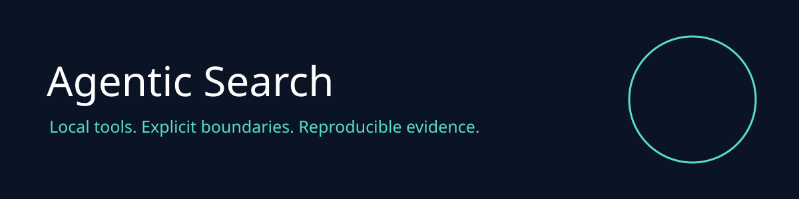

# Agentic Search v2

Search your own documents locally and return traceable source hashes. No API key or remote model is required.

## Capabilities

| Capability | Behavior |
| :--- | :--- |
| BM25 ranking | Deterministic lexical ranking, no semantic model claim |
| Citations | SHA256 of original source text |
| HTTP | Loopback, bearer token, origin rejection, request limits |

| CLI | status, test, benchmark, mcp |
| MCP | Project status, domain tool, policy resource |
| MetaHarness | Generated repo maintainer profiles and host integrations |

## Install and use

Node 22 or newer:

```sh
npm ci --ignore-scripts
node src/cli.js search "signed federation"
SEARCH_TOKEN=$(openssl rand -hex 32) npm start
npm test
npm run benchmark
npm run mcp
```

MCP uses stdio. Configure the host to run `node src/cli.js mcp` with this repository as its working directory. Only the operator configures corpus paths or origin permissions. Tool callers cannot execute shell commands or supply local paths. Returned content is untrusted data.

## Validation and release

CI runs regression tests, real SDK stdio tests and dependency audit. Benchmark output reports fixture performance only. Release artifacts require the same checks. See [architecture and security](docs/adr/0001-supported-v2.md). Historical functionality is described in [the archived README](docs/historical-readme.md); it is outside the supported v2 surface.

## Related projects

[RuFlo](https://github.com/ruvnet/ruflo) coordinates agents. [MetaHarness](https://github.com/ruvnet/metaharness) supplies host profiles and evaluations. [Autogenous](https://github.com/ruvnet/autogenous) provides governed improvement primitives. [RuVector](https://github.com/ruvnet/ruvector) supplies vector search primitives. [Federation](https://x.ruv.io/mcp) is a separate authenticated coordination service. No federation enrollment or publishing is performed by this package.

## Optional RuVector mode

`SEARCH_MODE=hybrid node src/cli.js search "signed federation"` uses pinned native RuVector, 256 dimensional lexical feature hashes and reciprocal rank fusion. These are lexical features, not learned embeddings. SHA256 citations are preserved. The native cosine results are checked against an independent scalar oracle. On the three document fixture, hybrid p95 was 0.508 ms versus BM25 0.0039 ms, so BM25 remains the default. The private temporary native index is removed on normal exit; abrupt process termination can leave a private temporary directory.

MCP `project_validate` and `project_benchmark` require operator environment `RUV_ALLOW_VALIDATION=1`. They launch only fixed commands, with a single process slot, 60 second deadline and 128 KiB output cap. Receipts are unsigned content hashes, not trusted attestations.
