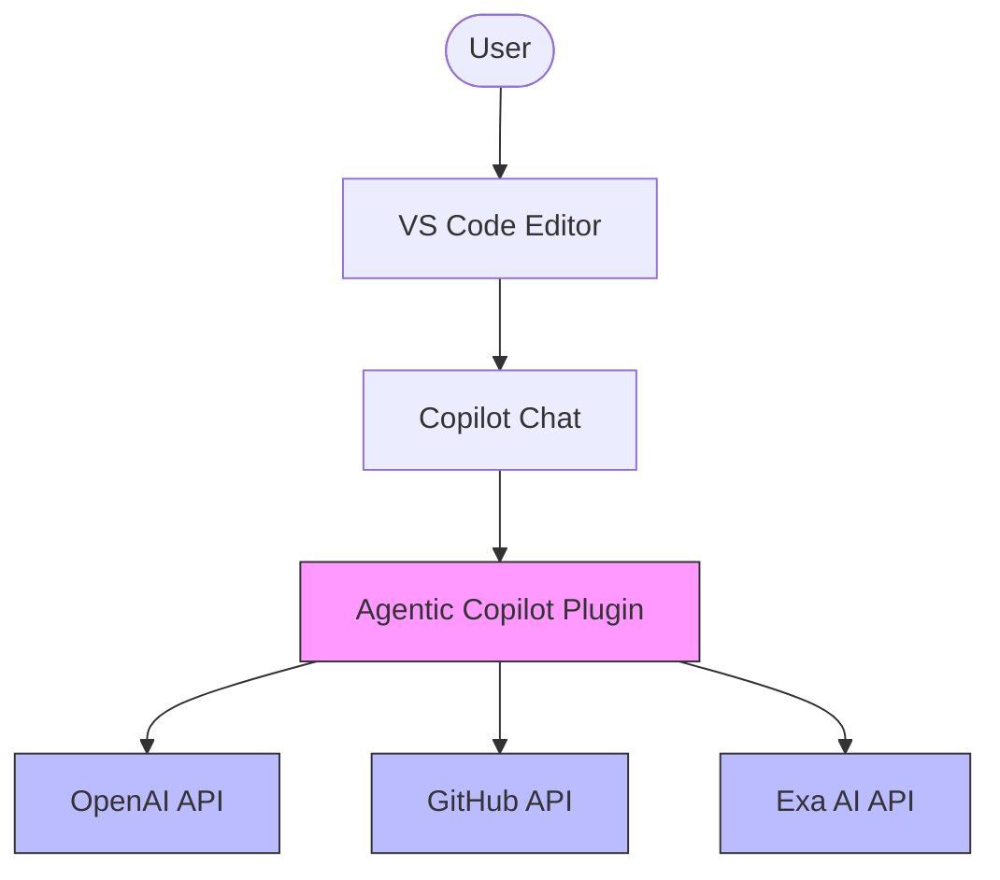
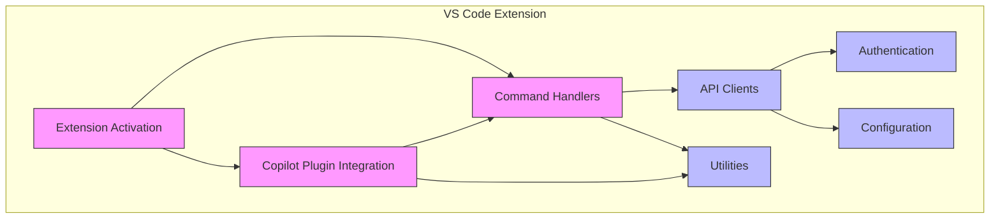
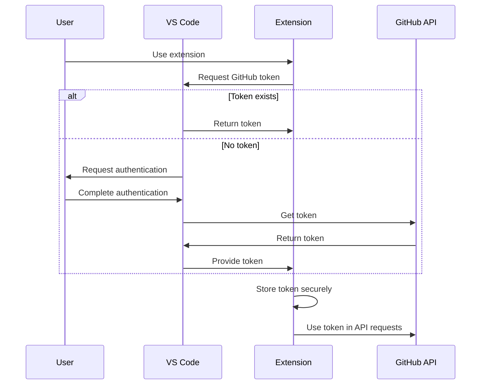
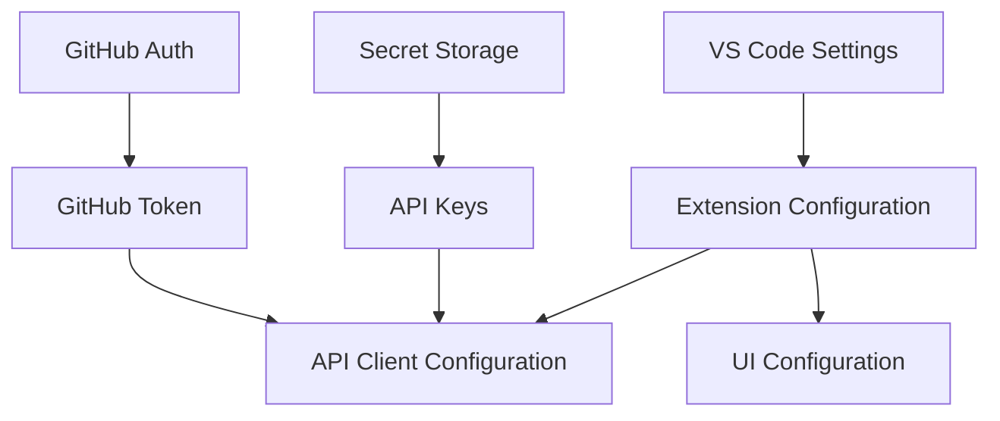

# Agentic Copilot VS Code Extension - Architecture Overview

## Introduction

This document provides a high-level overview of the Agentic Copilot VS Code extension architecture. It serves as the entry point to understanding the system design, providing links to detailed documentation about specific aspects of the architecture.

## Architecture Goals

The architecture has been designed with the following goals:

1. **Maintain Core Functionality**: Preserve all functionality from the server-based implementation
2. **VS Code Integration**: Seamlessly integrate with VS Code's extension ecosystem
3. **Modularity**: Create clear component boundaries with well-defined interfaces
4. **Extensibility**: Allow for easy addition of new commands and API integrations
5. **Performance**: Minimize impact on VS Code performance
6. **Security**: Securely handle API keys and authentication tokens

## System Context



The Agentic Copilot extension operates within the VS Code editor environment, integrating with Copilot Chat as a plugin. It interacts with three external API services:

1. **OpenAI API**: For AI model completions
2. **GitHub API**: For user authentication and repository data
3. **Exa AI API**: For enhanced search capabilities

## Architectural Overview



The architecture consists of several key components:

1. **Extension Activation**: Entry point that initializes all components
2. **Command Handlers**: Process user commands from Copilot Chat
3. **Copilot Plugin Integration**: Connects with Copilot Chat
4. **API Clients**: Communicate with external services
5. **Authentication**: Manages GitHub authentication
6. **Configuration**: Handles user settings and preferences
7. **Utilities**: Provides common functionality like response formatting

## Key Architectural Decisions

| Decision | Description | Rationale |
|----------|-------------|-----------|
| VS Code Extension | Implement as a VS Code extension rather than a standalone server | Enables deep integration with VS Code and simplifies deployment |
| Copilot Chat Plugin | Register as a Copilot Chat plugin | Leverages existing Copilot Chat UI rather than creating a custom UI |
| Command-Based Architecture | Structure around command processing | Maintains compatibility with existing slash commands |
| VS Code Authentication | Use VS Code authentication providers | Leverages secure, built-in authentication system |
| Progressive Responses | Stream responses incrementally | Provides immediate feedback for long-running operations |

## Component Structure

The extension is organized into the following component structure:

| Component | Responsibility | Key Files |
|-----------|----------------|-----------|
| Extension Activation | Initialize the extension | extension.ts |
| Command Handlers | Process user commands | commands/*.ts |
| Copilot Plugin | Connect with Copilot Chat | plugin/*.ts |
| API Clients | Communicate with external services | api/*.ts |
| Authentication | Manage GitHub authentication | auth/*.ts |
| Configuration | Handle user settings | config/*.ts |
| Utilities | Common functionality | utils/*.ts |

For a detailed view of the directory structure, see [Directory Structure](./directory-structure.md).

## Data Flow

The primary data flows in the system are:

1. **Command Processing**: User message → Command extraction → API request → Response formatting
2. **Authentication**: Authentication request → Token acquisition → Secure storage → API authorization
3. **Configuration**: User settings → VS Code configuration → Component configuration

For detailed data flow diagrams, see [Data Flow Diagrams](./data-flow-diagrams.md).

## API Integrations

The extension integrates with the following external APIs:

### OpenAI API

- **Purpose**: Generate AI completions for the `/openai` command
- **Authentication**: API key stored in user settings
- **Key Operations**: Generate completions and chat completions

### GitHub API

- **Purpose**: Authenticate users and search GitHub repositories
- **Authentication**: OAuth token via VS Code authentication provider
- **Key Operations**: User validation, repository search

### Exa AI API

- **Purpose**: Advanced search capabilities for the `/exa` and `/github` commands
- **Authentication**: API key stored in user settings
- **Key Operations**: Web search, GitHub-specific search

## Component Interfaces

The components interact through well-defined interfaces:

```typescript
// Core interfaces examples (simplified)

interface CommandHandler {
  canHandle(message: string): boolean;
  extractParams(message: string): CommandParams;
  execute(params: CommandParams): Promise<CommandResult>;
}

interface ApiClient {
  execute<T>(params: ApiRequestParams): Promise<ApiResponse<T>>;
  isConfigured(): boolean;
}

interface AuthProvider {
  getToken(): Promise<string>;
  isAuthenticated(): boolean;
  refreshToken(): Promise<string>;
}
```

For detailed interface definitions, see [Component Interfaces](./component-interfaces.md).

## Authentication Flow



The authentication flow leverages VS Code's built-in authentication providers to securely obtain and manage GitHub tokens.

## Configuration Management



Configuration is managed through:

1. **VS Code Settings**: User and workspace settings in settings.json
2. **Secret Storage**: Secure storage for sensitive information
3. **Environment Variables**: For development and testing

## Error Handling Strategy

The extension implements a comprehensive error handling strategy:

1. **Component-Level Handling**: Each component handles its own errors
2. **Graceful Degradation**: Maintain core functionality when possible
3. **User Feedback**: Provide clear error messages to users
4. **Logging**: Comprehensive logging for debugging

## Testing Strategy

The extension should be tested through:

1. **Unit Tests**: For individual components
2. **Integration Tests**: For component interactions
3. **End-to-End Tests**: For complete workflows
4. **Manual Testing**: For UI and user experience

## Implementation Roadmap

The implementation should follow this phased approach:

1. **Initial Scaffolding**: Create basic extension structure
2. **Core Functionality**: Implement command processing
3. **Authentication**: Implement GitHub authentication
4. **API Integration**: Connect with external APIs
5. **Copilot Integration**: Register and handle Copilot Chat interactions
6. **Testing and Refinement**: Ensure quality and performance
7. **Documentation and Distribution**: Prepare for release

## Extensibility Points

The architecture is designed with several extensibility points:

1. **New Commands**: Add new command handlers for additional functionality
2. **New API Integrations**: Add new API clients for additional services
3. **Enhanced Response Formats**: Extend response formatting capabilities
4. **Custom UI Elements**: Add VS Code-specific UI elements as needed

## Performance Considerations

Key performance considerations include:

1. **Lazy Loading**: Load components only when needed
2. **Caching**: Cache API responses and authentication tokens
3. **Incremental Responses**: Stream responses incrementally
4. **Minimal UI Blocking**: Perform operations asynchronously

## Security Considerations

Security considerations include:

1. **Secure Token Storage**: Use VS Code's secret storage for API keys and tokens
2. **Minimal Permission Scopes**: Request only necessary permissions
3. **No Sensitive Data Logging**: Avoid logging sensitive information
4. **Secure Communication**: Use HTTPS for all API communications

## Related Documentation

- [VS Code Extension Architecture](./vscode-extension-architecture.md) - Detailed architectural documentation
- [Directory Structure](./directory-structure.md) - Detailed directory structure and module organization
- [Data Flow Diagrams](./data-flow-diagrams.md) - Detailed data flow diagrams
- [Component Interfaces](./component-interfaces.md) - Detailed interface definitions

## Conclusion

The Agentic Copilot VS Code extension architecture provides a solid foundation for implementing the functionality of the server-based version as a VS Code extension. The architecture emphasizes modularity, clear interfaces, and integration with VS Code's extension ecosystem.

By following this architecture, the implementation will maintain the core functionality of the server version while fully leveraging the benefits of being a VS Code extension, including seamless integration, secure authentication, and improved user experience.