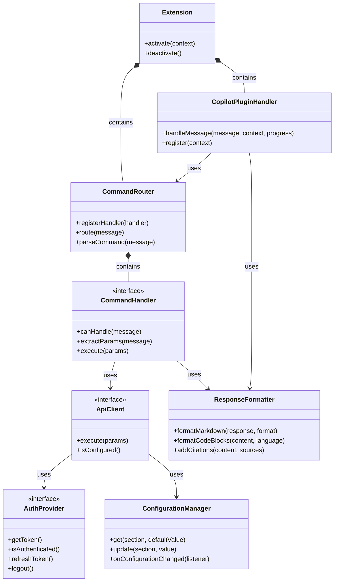

# Agentic Copilot VS Code Extension - Component Interfaces

This document defines the key interfaces and contracts between components in the Agentic Copilot VS Code extension. These interfaces establish clear boundaries and responsibilities for each component.

## Core Interfaces

### 1. Extension Activation

```typescript
/**
 * Main extension activation function called by VS Code
 * @param context The extension context provided by VS Code
 */
function activate(context: vscode.ExtensionContext): void;

/**
 * Extension deactivation function called by VS Code
 */
function deactivate(): void;
```

### 2. Command Handler

```typescript
/**
 * Interface for command handlers that process specific command types
 */
interface CommandHandler {
  /**
   * Check if this handler can process the given message
   * @param message The user message
   * @returns True if this handler can process the message
   */
  canHandle(message: string): boolean;
  
  /**
   * Extract parameters from the command message
   * @param message The user message
   * @returns Extracted command parameters
   */
  extractParams(message: string): CommandParams;
  
  /**
   * Execute the command with the given parameters
   * @param params The command parameters
   * @returns Command execution result
   */
  execute(params: CommandParams): Promise<CommandResult>;
}

/**
 * Command parameters extracted from user input
 */
interface CommandParams {
  /** The command name */
  command: string;
  /** The query or search term */
  query: string;
  /** Additional options provided with the command */
  options?: Record<string, any>;
}

/**
 * Result of command execution
 */
interface CommandResult {
  /** Success or failure status */
  success: boolean;
  /** Response data if successful */
  data?: any;
  /** Error message if failed */
  error?: string;
  /** Content type for formatting */
  contentType?: string;
}
```

### 3. Command Router

```typescript
/**
 * Routes commands to appropriate handlers
 */
interface CommandRouter {
  /**
   * Register a command handler
   * @param handler The command handler to register
   */
  registerHandler(handler: CommandHandler): void;
  
  /**
   * Route a message to the appropriate handler
   * @param message The user message
   * @returns Command execution result
   */
  route(message: string): Promise<CommandResult>;
  
  /**
   * Parse a message to identify commands
   * @param message The user message
   * @returns Command structure if found
   */
  parseCommand(message: string): Command | null;
}

/**
 * Command structure
 */
interface Command {
  /** The command name */
  name: string;
  /** The raw command string */
  raw: string;
  /** The query part of the command */
  query: string;
}
```

### 4. API Client

```typescript
/**
 * Base interface for API clients
 */
interface ApiClient {
  /**
   * Execute an API request
   * @param params Request parameters
   * @returns API response
   */
  execute<T>(params: ApiRequestParams): Promise<ApiResponse<T>>;
  
  /**
   * Check if the client is properly configured
   * @returns True if the client is configured
   */
  isConfigured(): boolean;
}

/**
 * API request parameters
 */
interface ApiRequestParams {
  /** Endpoint path */
  endpoint?: string;
  /** Request method */
  method?: 'GET' | 'POST' | 'PUT' | 'DELETE';
  /** Query parameters */
  queryParams?: Record<string, string>;
  /** Request body */
  body?: any;
  /** Request headers */
  headers?: Record<string, string>;
  /** Request timeout in ms */
  timeout?: number;
}

/**
 * API response structure
 */
interface ApiResponse<T> {
  /** Response data */
  data?: T;
  /** Error information if request failed */
  error?: {
    /** Error code */
    code: string;
    /** Error message */
    message: string;
    /** Additional error details */
    details?: any;
  };
  /** HTTP status code */
  status: number;
  /** Response headers */
  headers?: Record<string, string>;
}
```

### 5. Authentication Provider

```typescript
/**
 * Manages authentication with services
 */
interface AuthProvider {
  /**
   * Get an authentication token
   * @returns The auth token
   */
  getToken(): Promise<string>;
  
  /**
   * Check if the user is authenticated
   * @returns True if authenticated
   */
  isAuthenticated(): boolean;
  
  /**
   * Force refreshing the token
   * @returns The new token
   */
  refreshToken(): Promise<string>;
  
  /**
   * Clear stored authentication
   */
  logout(): Promise<void>;
}

/**
 * Secure token storage
 */
interface TokenStorage {
  /**
   * Store a token securely
   * @param key The token key
   * @param token The token value
   */
  storeToken(key: string, token: string): Promise<void>;
  
  /**
   * Retrieve a token
   * @param key The token key
   * @returns The token value
   */
  getToken(key: string): Promise<string>;
  
  /**
   * Check if a token exists
   * @param key The token key
   * @returns True if token exists
   */
  hasToken(key: string): Promise<boolean>;
  
  /**
   * Delete a token
   * @param key The token key
   */
  deleteToken(key: string): Promise<void>;
}
```

### 6. Configuration Manager

```typescript
/**
 * Manages extension configuration
 */
interface ConfigurationManager {
  /**
   * Get a configuration value
   * @param section Configuration section
   * @param defaultValue Default value if not found
   * @returns Configuration value
   */
  get<T>(section: string, defaultValue?: T): T;
  
  /**
   * Update a configuration value
   * @param section Configuration section
   * @param value New value
   */
  update<T>(section: string, value: T): Promise<void>;
  
  /**
   * Register a configuration change listener
   * @param listener Function to call when configuration changes
   * @returns Disposable to unregister the listener
   */
  onConfigurationChanged(listener: (e: ConfigChangeEvent) => void): vscode.Disposable;
}

/**
 * Configuration change event
 */
interface ConfigChangeEvent {
  /** Section that changed */
  section: string;
  /** Old value */
  oldValue?: any;
  /** New value */
  newValue?: any;
}
```

### 7. Copilot Plugin Handler

```typescript
/**
 * Handles Copilot Chat plugin integrations
 */
interface CopilotPluginHandler {
  /**
   * Process a message from Copilot Chat
   * @param message The user message
   * @param context Chat context
   * @param progress Progress reporter for streaming responses
   * @returns Response to the message
   */
  handleMessage(
    message: string, 
    context: ChatContext,
    progress: vscode.Progress<{message: string}>
  ): Promise<void>;
  
  /**
   * Register the plugin with Copilot Chat
   * @param context Extension context
   */
  register(context: vscode.ExtensionContext): void;
}

/**
 * Chat context from Copilot
 */
interface ChatContext {
  /** Chat conversation ID */
  conversationId: string;
  /** Previous messages */
  history: ChatMessage[];
  /** Additional context variables */
  variables: Record<string, any>;
}

/**
 * Chat message structure
 */
interface ChatMessage {
  /** Message ID */
  id: string;
  /** Message role (user or assistant) */
  role: 'user' | 'assistant';
  /** Message content */
  content: string;
  /** Timestamp */
  timestamp: Date;
}
```

### 8. Response Formatter

```typescript
/**
 * Formats responses for display
 */
interface ResponseFormatter {
  /**
   * Format a response as markdown
   * @param response Raw response data
   * @param format Optional formatting options
   * @returns Formatted markdown
   */
  formatMarkdown(response: any, format?: FormatOptions): string;
  
  /**
   * Format code blocks within content
   * @param content Content with code blocks
   * @param language Programming language
   * @returns Formatted code blocks
   */
  formatCodeBlocks(content: string, language?: string): string;
  
  /**
   * Add citations to content
   * @param content Content to add citations to
   * @param sources Source information
   * @returns Content with citations
   */
  addCitations(content: string, sources: SourceInfo[]): string;
}

/**
 * Formatting options
 */
interface FormatOptions {
  /** Include code highlighting */
  codeHighlighting?: boolean;
  /** Include citations */
  citations?: boolean;
  /** Heading level to start with */
  headingLevel?: number;
}

/**
 * Source information for citations
 */
interface SourceInfo {
  /** Source title */
  title: string;
  /** Source URL */
  url?: string;
  /** Publication date */
  date?: string;
  /** Source author */
  author?: string;
}
```

## Component Interaction Examples

### Command Processing Interaction

```typescript
// Example of component interactions for command processing

// 1. User types a message in Copilot Chat
const userMessage = "@Agentic /exa quantum computing";

// 2. Copilot Chat plugin handler receives the message
pluginHandler.handleMessage(userMessage, chatContext, progress)
  .then(() => {
    // Message handling complete
  })
  .catch(error => {
    // Error occurred
  });

// 3. Plugin handler extracts the command
const command = commandRouter.parseCommand(userMessage);
// command = { name: "exa", raw: "/exa quantum computing", query: "quantum computing" }

// 4. Command router routes to appropriate handler
commandRouter.route(userMessage)
  .then(result => {
    // Command execution complete
    // result = { success: true, data: {...}, contentType: "search-results" }
  });

// 5. Exa command handler processes the command
const exaHandler = new ExaCommandHandler(apiClient, configManager);
const params = exaHandler.extractParams(userMessage);
// params = { command: "exa", query: "quantum computing" }

exaHandler.execute(params)
  .then(result => {
    // Command execution complete
  });

// 6. API client executes the request
apiClient.execute({
  endpoint: "/search",
  method: "POST",
  body: { query: "quantum computing" }
})
.then(response => {
  // API response received
});

// 7. Response formatter formats the result
const formattedResponse = responseFormatter.formatMarkdown(
  result.data,
  { codeHighlighting: true, citations: true }
);

// 8. Progress reporter sends incremental updates
progress.report({ message: formattedResponse });
```

### Authentication Interaction

```typescript
// Example of component interactions for authentication

// 1. Command handler needs to make an authenticated request
commandHandler.execute(params)
  .then(result => {
    // Command execution complete
  });

// 2. API client needs authentication
apiClient.execute(requestParams)
  .then(response => {
    // API response received
  });

// Inside the API client execution:
async execute(params) {
  // Get token from auth provider
  const token = await authProvider.getToken();
  
  // Add token to request headers
  params.headers = {
    ...params.headers,
    "Authorization": `Bearer ${token}`
  };
  
  // Make the API request
  const response = await makeRequest(params);
  
  // Handle token expiration
  if (response.status === 401) {
    // Token expired, refresh and retry
    const newToken = await authProvider.refreshToken();
    params.headers["Authorization"] = `Bearer ${newToken}`;
    return await makeRequest(params);
  }
  
  return response;
}

// 3. Auth provider gets token from storage or VS Code
async getToken() {
  // Check if token is in cache
  if (this.cachedToken && !this.isTokenExpired(this.cachedToken)) {
    return this.cachedToken.value;
  }
  
  // Try to get from storage
  try {
    const hasToken = await this.tokenStorage.hasToken(this.tokenKey);
    if (hasToken) {
      const token = await this.tokenStorage.getToken(this.tokenKey);
      if (!this.isTokenExpired(token)) {
        this.cachedToken = { value: token, timestamp: Date.now() };
        return token;
      }
    }
  } catch (error) {
    // Token storage error, fall through to request new token
  }
  
  // Request from VS Code auth session
  const session = await vscode.authentication.getSession(
    'github', 
    ['user:email', 'repo'], 
    { createIfNone: true }
  );
  
  // Store the new token
  await this.tokenStorage.storeToken(this.tokenKey, session.accessToken);
  this.cachedToken = { value: session.accessToken, timestamp: Date.now() };
  
  return session.accessToken;
}
```

### Configuration Interaction

```typescript
// Example of component interactions for configuration

// 1. Initialize configuration manager
const configManager = new ConfigurationManager();

// 2. API client uses configuration
class ExaApiClient implements ApiClient {
  private configManager: ConfigurationManager;
  
  constructor(configManager: ConfigurationManager) {
    this.configManager = configManager;
    
    // Listen for configuration changes
    this.configManager.onConfigurationChanged(e => {
      if (e.section === 'agenticCopilot.exa.apiKey') {
        // API key changed, update client configuration
        this.updateApiKey(e.newValue);
      }
    });
  }
  
  private updateApiKey(newKey: string) {
    this.apiKey = newKey;
  }
  
  execute(params: ApiRequestParams): Promise<ApiResponse> {
    // Get API key from configuration
    const apiKey = this.configManager.get<string>('agenticCopilot.exa.apiKey');
    
    // Add API key to headers
    params.headers = {
      ...params.headers,
      "X-API-Key": apiKey
    };
    
    // Execute request
    return this.makeRequest(params);
  }
  
  isConfigured(): boolean {
    const apiKey = this.configManager.get<string>('agenticCopilot.exa.apiKey');
    return !!apiKey;
  }
}

// 3. User updates settings in VS Code
// (VS Code triggers configuration change event)

// 4. Configuration manager notifies listeners
// (API client receives notification and updates)
```

## Interface Guidelines

When implementing these interfaces, follow these guidelines:

1. **Single Responsibility**: Each component should have a single responsibility and its interfaces should reflect that focus.

2. **Dependency Inversion**: Higher-level components should not depend on lower-level components, but both should depend on abstractions.

3. **Interface Segregation**: Keep interfaces small and focused. A component should not be forced to implement interfaces it does not use.

4. **Explicit Dependencies**: Make dependencies explicit in constructors rather than obtaining them from global state.

5. **Error Handling**: Include appropriate error handling in all interface methods, with clear error types and messages.

6. **Asynchronous Design**: Use Promise-based APIs for operations that may take time or could fail.

7. **Progressive Updates**: For long-running operations, provide mechanisms for reporting progress.

8. **Immutable Data**: Prefer immutable data structures for parameters and return values.

9. **Testability**: Design interfaces with testing in mind, allowing for easy mocking of dependencies.

## Key Dependencies

The following diagram shows the dependency relationships between key components:



This document provides a comprehensive set of interfaces for the Agentic Copilot VS Code extension. These interfaces define clear boundaries between components, ensuring a modular and maintainable architecture.