# Agentic Copilot VS Code Extension - Data Flow Diagrams

This document provides detailed data flow diagrams for the Agentic Copilot VS Code extension, illustrating how data moves through the system during key operations.

## 1. High-Level System Data Flow

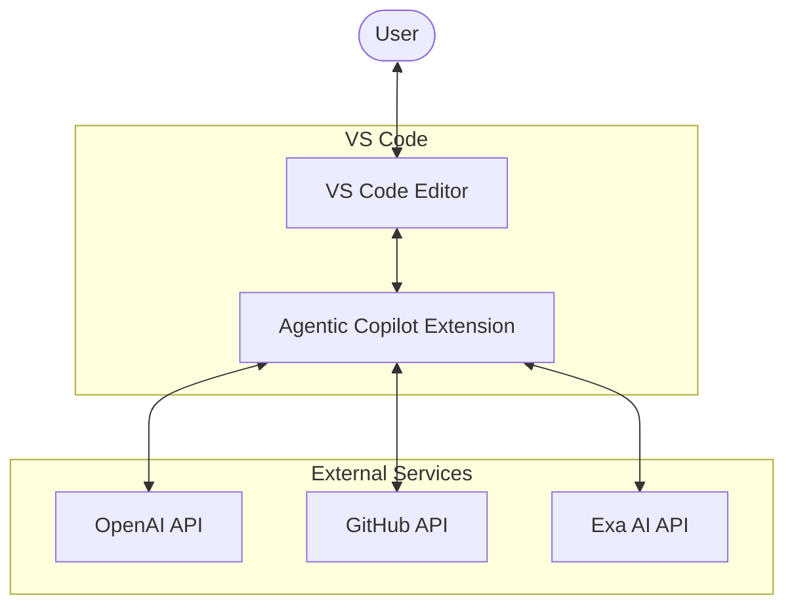

## 2. Command Processing Flow

### 2.1 Command Detection and Routing

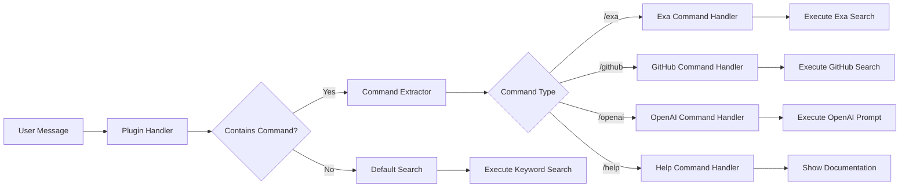

### 2.2 Command Execution Flow

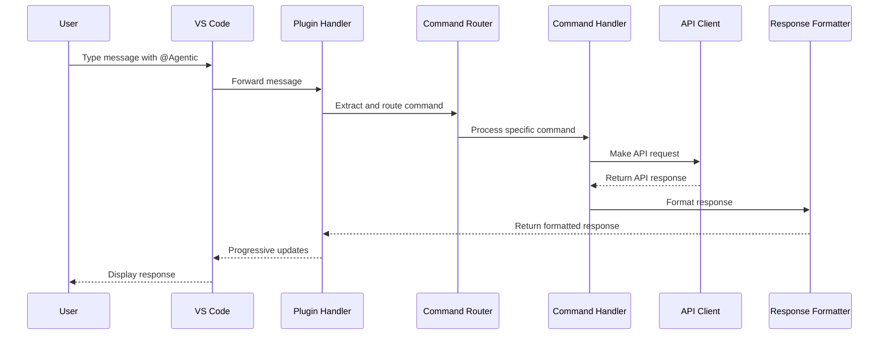

## 3. Authentication Flow

### 3.1 Initial Authentication

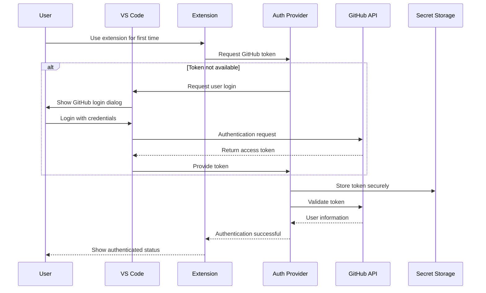

### 3.2 Token Usage Flow

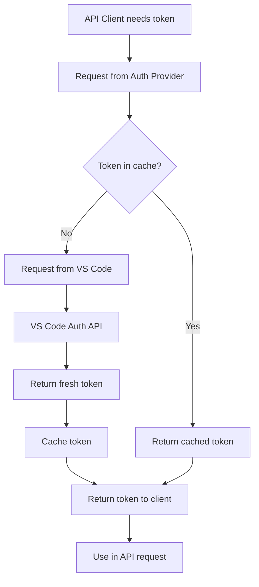

## 4. Response Processing Flow

### 4.1 Response Formatting and Streaming

```mermaid
flowchart LR
    A[Raw API Response] --> B[Parse JSON]
    B --> C[Extract relevant data]
    C --> D[Convert to Markdown]
    D --> E[Add formatting]
    E --> F[Process code blocks]
    F --> G[Add citations]
    G --> H[Split into chunks]
    H --> I[Stream progressively]
    I --> J[Display in VS Code]
```

### 4.2 Streaming Sequence

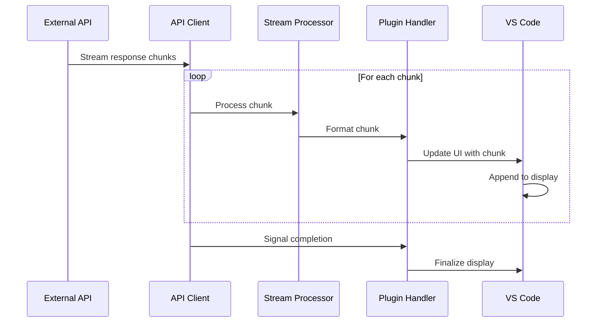

## 5. Configuration Flow

### 5.1 Settings Management

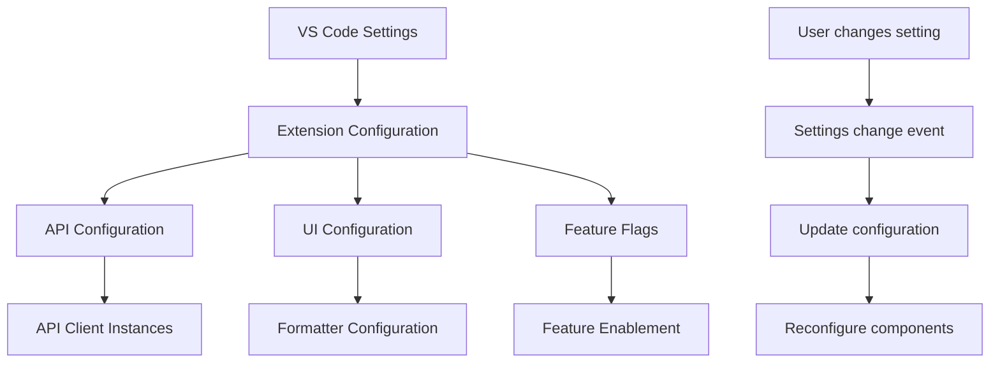

### 5.2 Secret Management

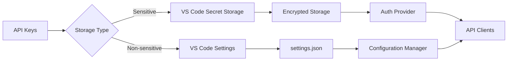

## 6. Plugin Integration Flow

### 6.1 Copilot Chat Integration

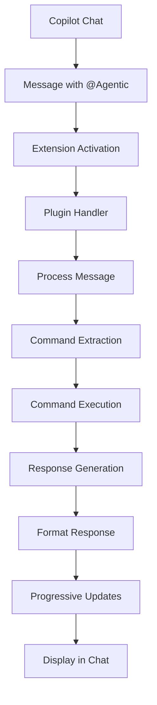

### 6.2 Plugin Registration

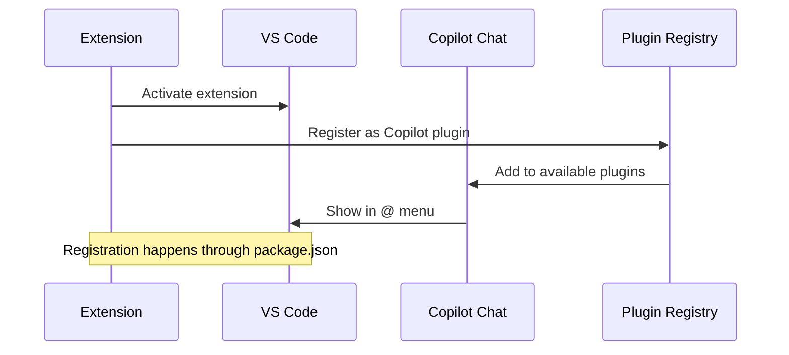

## 7. Error Handling Flow

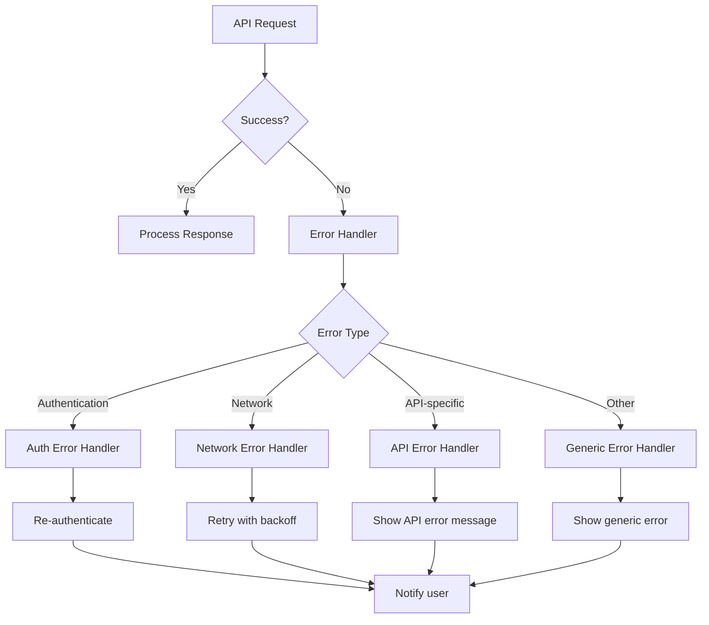

## 8. End-to-End Command Flow Example

### 8.1 Example: `/exa` Command Flow

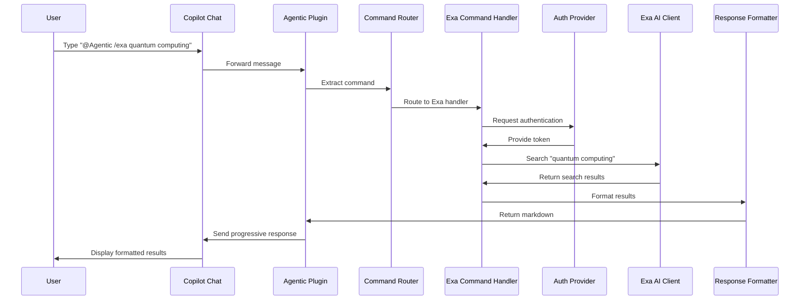

### 8.2 Example: `/github` Command Flow

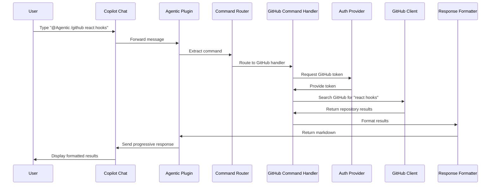

## 9. Data Transformation Points

This diagram highlights where data transformations occur in the system:

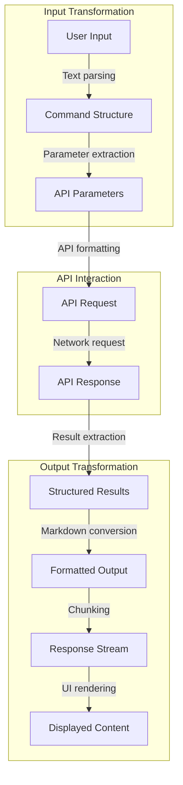

These data flow diagrams provide a comprehensive view of how data moves through the Agentic Copilot VS Code extension, highlighting the key interaction points, transformation stages, and system integrations.