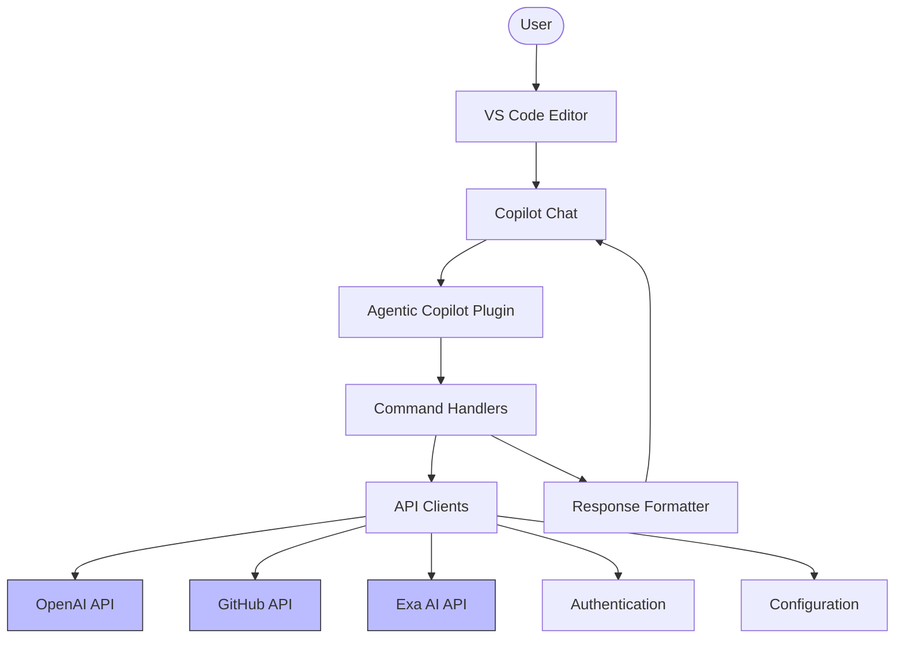
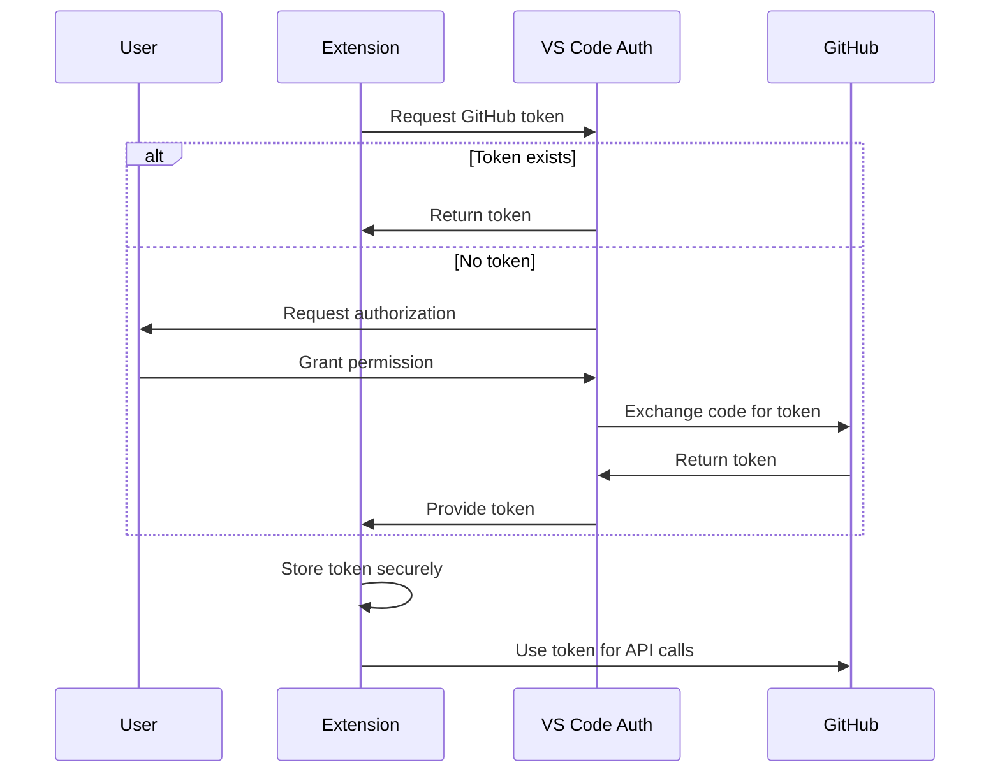

# Agentic Copilot VS Code Extension - Architecture Documentation

## Documentation Index

This documentation provides a comprehensive architecture design for the VS Code extension version of Agentic Copilot. It is organized into several sections, each focusing on a specific aspect of the architecture.

| Document | Description |
|----------|-------------|
| [Architecture Overview](./architecture-overview.md) | High-level overview of the entire architecture |
| [VS Code Extension Architecture](./vscode-extension-architecture.md) | Detailed design of the VS Code extension structure |
| [Directory Structure](./directory-structure.md) | Detailed directory and file organization |
| [Data Flow Diagrams](./data-flow-diagrams.md) | Visualizations of data flows within the system |
| [Component Interfaces](./component-interfaces.md) | Interface definitions and component contracts |

## Architecture Summary

The Agentic Copilot VS Code extension architecture takes the existing server-based implementation and adapts it to VS Code's extension model while preserving all core functionality.

### Key Features

- **Copilot Chat Integration**: Registers as a Copilot Chat plugin accessible via the "@" menu
- **Command Processing**: Supports existing slash commands (/exa, /github, /openai)
- **GitHub Authentication**: Uses VS Code's authentication providers for secure token management
- **API Integrations**: Connects with OpenAI, GitHub, and Exa AI services
- **Configuration Management**: Uses VS Code's settings system for user preferences

### Core Components

The architecture consists of these core components:

1. **Extension Activation**: Entry point that initializes all components and registers with VS Code
2. **Command Handlers**: Process user commands and route to appropriate services
3. **Copilot Plugin Integration**: Connects with Copilot Chat for user interaction
4. **API Clients**: Communicate with external services like OpenAI, GitHub, and Exa AI
5. **Authentication Provider**: Manages secure authentication with GitHub and other services
6. **Configuration Manager**: Handles user settings and extension configuration
7. **Response Formatter**: Formats API responses for display in Copilot Chat

### Architecture Diagrams



### Module Organization

The extension is organized into a clear directory structure:

```
agentic-copilot-vscode/
├── src/
│   ├── extension.ts
│   ├── activation/
│   ├── api/
│   ├── auth/
│   ├── commands/
│   ├── config/
│   ├── plugin/
│   └── utils/
└── package.json
```

Each module has clear responsibilities and interfaces with other modules through well-defined contracts.

### Authentication Flow

Authentication leverages VS Code's built-in authentication providers:



### Command Handling Pipeline

The command handling pipeline processes user input and returns formatted responses:

```mermaid
flowchart LR
    A[User Message] --> B[Plugin Handler]
    B --> C[Command Extractor]
    C --> D[Command Router]
    D --> E[Command Handler]
    E --> F[API Client]
    F --> G[External API]
    G --> H[API Response]
    H --> I[Response Formatter]
    I --> J[Formatted Output]
    J --> K[Copilot Chat]
```



## Implementation Guidance

When implementing this architecture, follow these key principles:

1. **Modular Design**: Keep components focused and responsibilities clear
2. **Interface-First Development**: Define interfaces before implementation
3. **Progressive Implementation**: Implement core functionality first, then add features
4. **Comprehensive Testing**: Test each component individually and in integration
5. **Security Focus**: Carefully handle authentication and sensitive information

## Comparison to Server Architecture

This architecture transforms the server-based implementation by:

1. Replacing HTTP endpoints with VS Code extension activation
2. Using VS Code's authentication instead of HTTP header tokens
3. Integrating with Copilot Chat instead of custom UI
4. Using VS Code's settings system instead of environment variables
5. Leveraging VS Code's event system instead of HTTP request/response cycles

## Next Steps

To begin implementation, follow this recommended approach:

1. Set up the basic VS Code extension structure
2. Implement the authentication provider using VS Code authentication
3. Port the API clients from the server implementation
4. Implement the command handlers and router
5. Create the Copilot Chat plugin integration
6. Implement response formatting and streaming
7. Add configuration management
8. Thoroughly test all components

This architecture provides a comprehensive blueprint for implementing the Agentic Copilot VS Code extension, ensuring a modular, maintainable, and user-friendly experience.