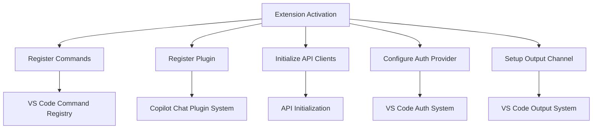
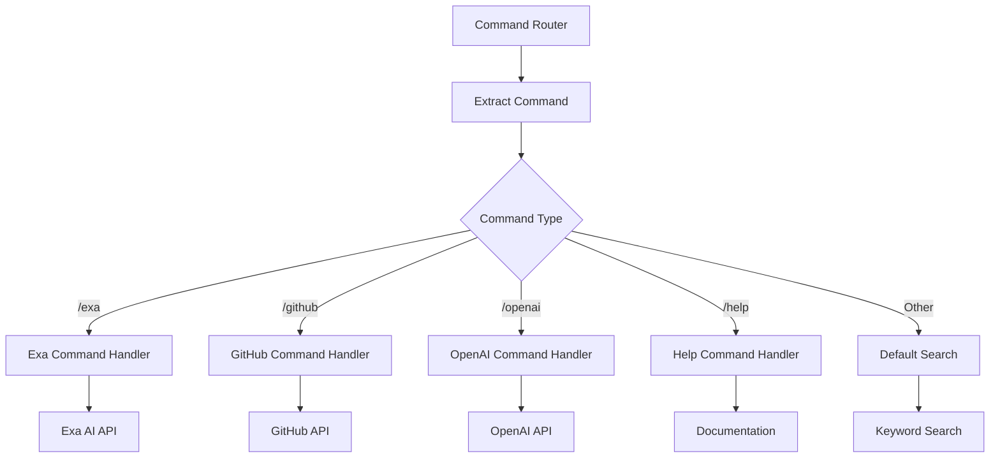
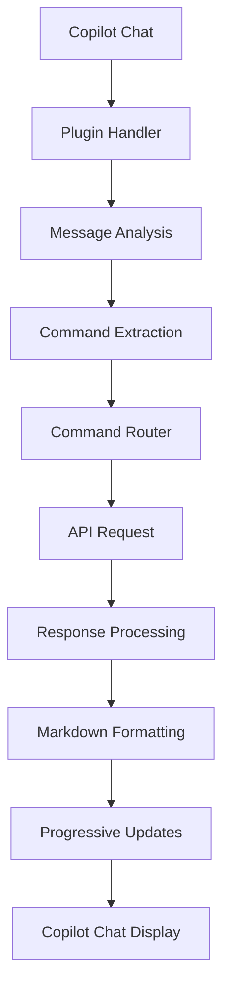
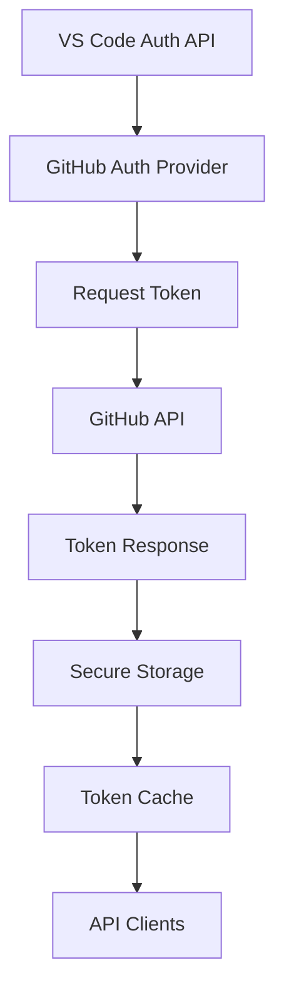
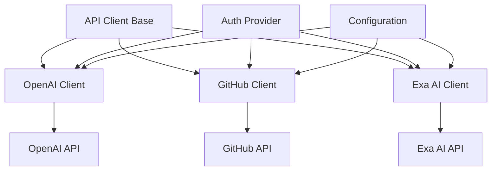
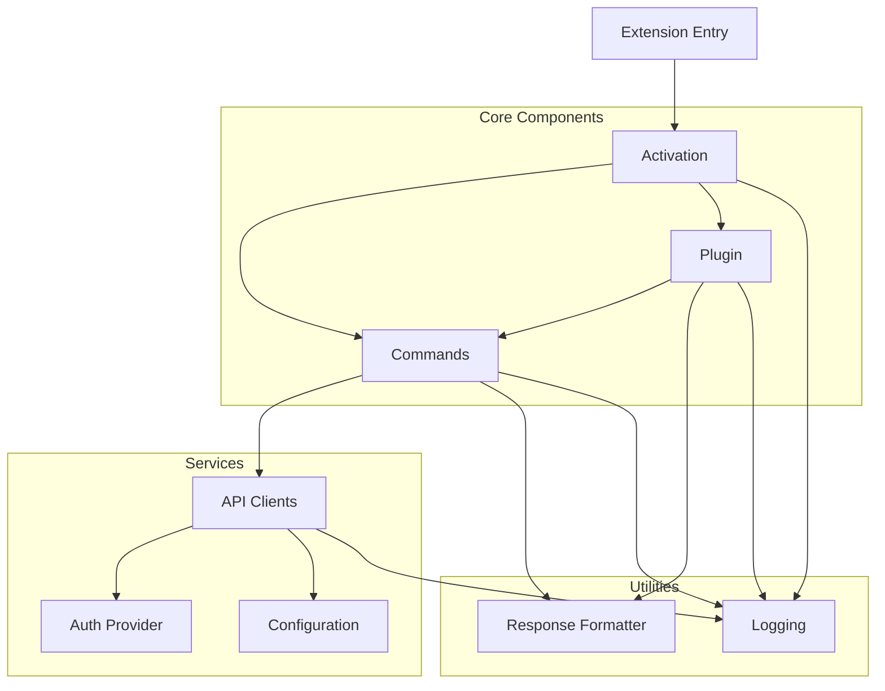
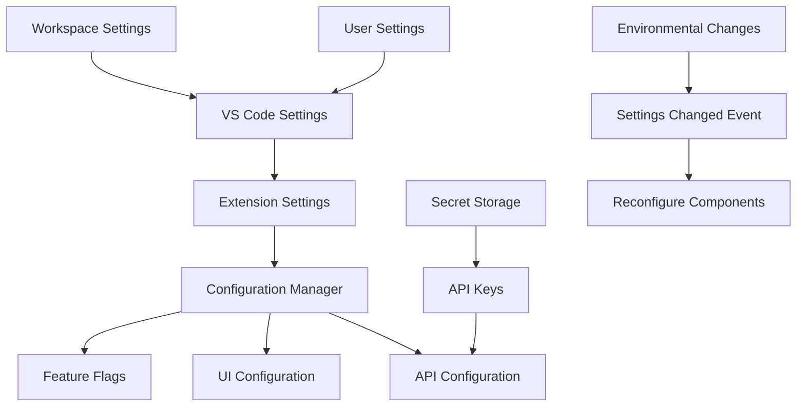
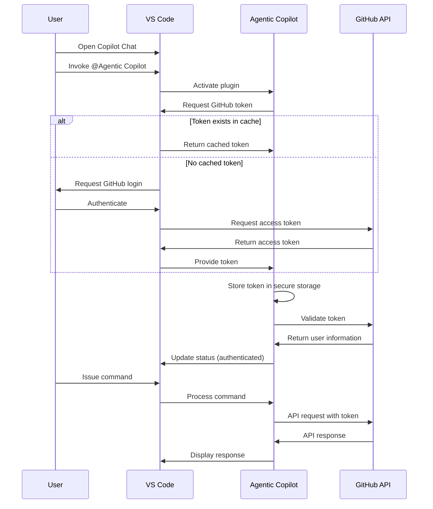
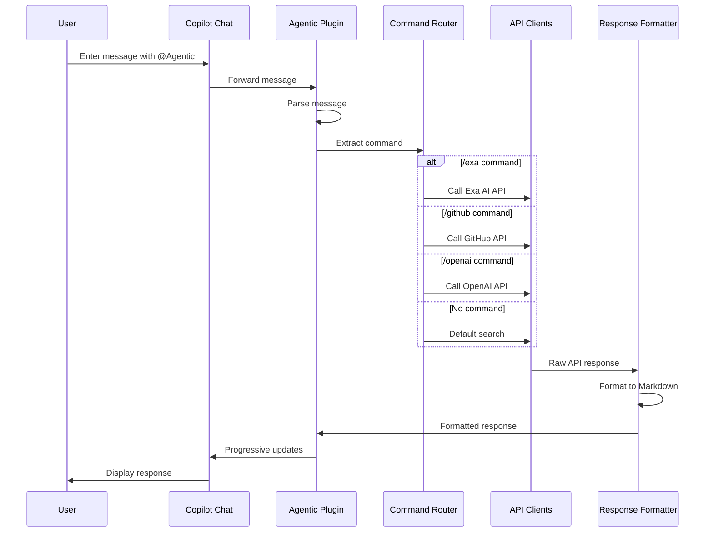

# Agentic Copilot - VS Code Extension Architecture

## Overview

This document outlines the architecture for the VS Code extension version of Agentic Copilot, providing a comprehensive guide for implementation. The architecture has been designed to preserve the core functionality of the server-based version while leveraging VS Code's extension capabilities.

## Directory Structure

```
agentic-copilot-vscode/
├── .vscode/                       # VS Code configuration files
│   ├── launch.json                # Debug configuration
│   └── tasks.json                 # Build tasks
├── src/                           # Source code
│   ├── extension.ts               # Main extension entry point
│   ├── activation/                # Extension activation logic
│   │   ├── index.ts               # Exports activation functionality
│   │   ├── registerCommands.ts    # Command registration
│   │   └── registerPlugin.ts      # Copilot plugin registration
│   ├── api/                       # API clients
│   │   ├── index.ts               # Exports API modules
│   │   ├── openai.ts              # OpenAI API client
│   │   ├── github.ts              # GitHub API client
│   │   └── exa.ts                 # Exa AI API client
│   ├── auth/                      # Authentication
│   │   ├── index.ts               # Exports auth modules
│   │   ├── githubAuth.ts          # GitHub authentication provider
│   │   └── tokenStorage.ts        # Secure token storage
│   ├── commands/                  # Command handlers
│   │   ├── index.ts               # Exports command handlers
│   │   ├── commandRouter.ts       # Routes commands to handlers
│   │   ├── exaCommand.ts          # Exa search command
│   │   ├── githubCommand.ts       # GitHub search command
│   │   ├── openaiCommand.ts       # OpenAI prompt command
│   │   └── helpCommand.ts         # Help command
│   ├── config/                    # Configuration
│   │   ├── index.ts               # Exports configuration
│   │   ├── settings.ts            # VS Code settings
│   │   └── constants.ts           # Constants and defaults
│   ├── plugin/                    # Copilot plugin integration
│   │   ├── index.ts               # Exports plugin modules
│   │   ├── pluginHandler.ts       # Plugin message handling
│   │   └── commandExtractor.ts    # Extract commands from messages
│   └── utils/                     # Utilities
│       ├── index.ts               # Exports utility functions
│       ├── formatting.ts          # Response formatting
│       ├── logging.ts             # Logging to output channel
│       └── streaming.ts           # Response streaming
├── package.json                   # Extension manifest
├── tsconfig.json                  # TypeScript configuration
├── webpack.config.js              # Webpack configuration
└── README.md                      # Extension documentation
```

## Core Extension Components

### 1. Extension Activation



The extension activation process is the entry point that initializes all components:

- **Entry Point**: `extension.ts` exports `activate` and `deactivate` functions
- **Command Registration**: Registers VS Code commands for both UI and background operations
- **Plugin Registration**: Registers as a Copilot Chat plugin that can be invoked with "@Agentic Copilot"
- **API Client Initialization**: Sets up clients for OpenAI, GitHub, and Exa AI
- **Authentication Setup**: Configures the GitHub authentication provider
- **Logging**: Creates an output channel for extension logs

### 2. Command Handlers



Command handlers process user inputs and route to appropriate API services:

- **Command Router**: Routes commands based on prefixes
- **Command Extractors**: Parse commands and extract parameters
- **Specialized Handlers**: Separate handlers for each command type
- **Default Handler**: Processes inputs without specific command prefixes

### 3. Copilot Plugin Integration



The Copilot Plugin integration handles the connection with VS Code's Copilot Chat:

- **Plugin Handler**: Receives and processes messages from Copilot Chat
- **Message Analysis**: Analyzes messages to identify commands or search queries
- **Command Extraction**: Extracts command parameters and validates input
- **Response Processing**: Handles API responses and formats for display
- **Progressive Updates**: Streams responses back to the Copilot Chat interface

### 4. Authentication Provider



The authentication provider manages secure access to GitHub and other services:

- **VS Code Auth API**: Leverages VS Code's built-in authentication providers
- **GitHub Auth Provider**: Specialized provider for GitHub authentication
- **Token Management**: Securely stores and retrieves tokens
- **Token Cache**: Caches tokens to minimize authentication requests
- **Auth Headers**: Supplies authentication headers for API requests

### 5. API Clients



API clients handle communication with external services:

- **Base Client**: Common functionality for all API clients
- **Specialized Clients**: Separate clients for each external API
- **Authentication Integration**: Uses tokens from authentication provider
- **Configuration Integration**: Uses settings from configuration manager
- **Error Handling**: Consistent error handling and retries

## Module Relationships and Dependencies



Key module relationships include:

1. **Extension Entry → Activation**: The extension entry point initializes the activation process
2. **Activation → Commands & Plugin**: Activation sets up both commands and plugin functionality
3. **Plugin → Commands**: The plugin uses command handlers to process requests
4. **Commands → API Clients**: Command handlers use API clients to access external services
5. **API Clients → Auth & Config**: API clients depend on authentication and configuration
6. **Commands & Plugin → Response Formatter**: Both commands and plugin use the response formatter

## Configuration Management Approach



The configuration management approach leverages VS Code's built-in facilities:

- **VS Code Settings**: Uses settings.json for user-configurable options
- **Workspace vs. User Settings**: Supports both global and workspace-specific settings
- **Configuration Categories**:
  - API Settings: Endpoints, timeouts, retry policies
  - UI Settings: Response formatting, display options
  - Feature Flags: Enable/disable specific features
- **Secret Storage**: Sensitive information stored in VS Code's secret storage
- **Change Detection**: Listens for configuration changes and updates components

### Settings Schema

```json
{
  "agenticCopilot.openai.apiKey": {
    "type": "string",
    "description": "OpenAI API key",
    "scope": "application"
  },
  "agenticCopilot.exa.apiKey": {
    "type": "string",
    "description": "Exa AI API key",
    "scope": "application" 
  },
  "agenticCopilot.api.timeout": {
    "type": "number",
    "default": 30000,
    "description": "Timeout for API requests in milliseconds"
  },
  "agenticCopilot.formatting.codeBlocks": {
    "type": "boolean",
    "default": true,
    "description": "Enable syntax highlighting in code blocks"
  }
}
```

## Authentication Flow



The authentication flow leverages VS Code's built-in authentication providers:

1. **Initial Request**: User invokes the extension through Copilot Chat
2. **Token Request**: Extension requests GitHub token from VS Code
3. **Authentication Process**: 
   - If token exists, VS Code returns it from cache
   - If not, VS Code handles GitHub authentication flow
4. **Token Storage**: Extension securely stores token in extension context
5. **Token Validation**: Token is validated with GitHub API
6. **Token Usage**: Token is used for subsequent API requests
7. **Token Refresh**: VS Code handles token expiration and refresh

## Command Handling Pipeline



The command handling pipeline processes user inputs and returns formatted responses:

1. **Input Reception**: User message received via Copilot Chat
2. **Message Parsing**: Message analyzed to identify commands
3. **Command Extraction**: Command and parameters extracted
4. **Command Routing**: Based on command type, routed to appropriate handler
5. **API Interaction**: Handler calls appropriate API client
6. **Response Processing**: API response processed and formatted
7. **Progressive Display**: Formatted response sent back to Copilot Chat
8. **User Presentation**: Response displayed to user with formatting

### Command Handler Structure

```typescript
interface CommandHandler {
  // Check if this handler can process the command
  canHandle(message: string): boolean;
  
  // Extract parameters from the command
  extractParams(message: string): CommandParams;
  
  // Execute the command and return results
  execute(params: CommandParams): Promise<CommandResult>;
}

interface CommandRouter {
  // Route a message to the appropriate handler
  route(message: string): Promise<CommandResult>;
  
  // Register a command handler
  registerHandler(handler: CommandHandler): void;
}
```

## Implementation Strategy

The implementation should follow this phased approach:

1. **Scaffolding**: Create basic VS Code extension structure with activation logic
2. **Core Configuration**: Implement settings and authentication providers
3. **API Clients**: Migrate API client code from server to extension
4. **Command Handlers**: Implement command processing logic
5. **Plugin Integration**: Connect with Copilot Chat plugin system
6. **Response Formatting**: Implement response formatting and streaming
7. **Testing**: Comprehensive testing across different VS Code environments
8. **Packaging**: Prepare for distribution via VS Code Marketplace

## Conclusion

This architecture provides a comprehensive blueprint for implementing the Agentic Copilot as a VS Code extension. By following this design, the implementation will maintain the core functionality of the server version while fully integrating with VS Code's extension ecosystem.

The design emphasizes modularity, separation of concerns, and clear interfaces between components, making the codebase maintainable and extensible for future enhancements.